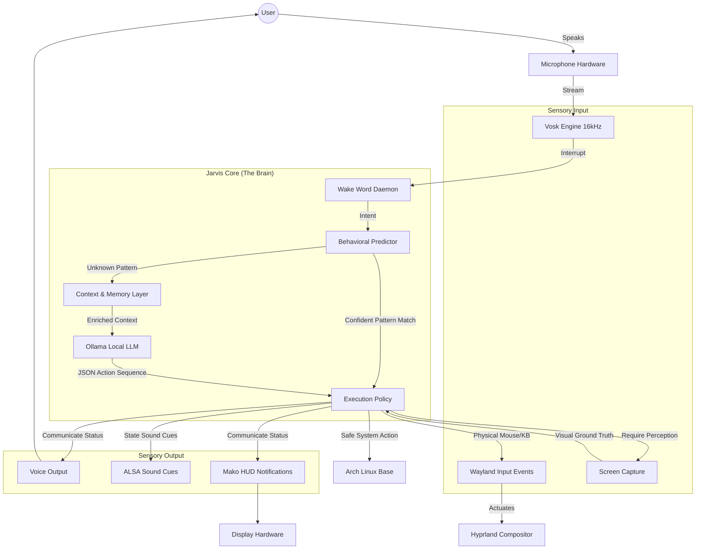

# System Architecture: Jarvis OS

Jarvis OS is not an application. It is an AI-native runtime layer deeply embedded into an Arch Linux operating system. The architecture is designed for zero-latency execution, visual perception, and offline persistence.

## Core Architecture Diagram

## System Components Breakdown

### 1. The Body (Arch Linux & Hyprland)
Jarvis relies on **Archiso** to compile a complete, minimal Arch Linux operating system. The display protocol is **Wayland** running the **Hyprland** compositor. This ensures low-overhead performance while allowing Jarvis to natively intercept display and input states safely.

### 2. The Perception Layer
- **Screen Awareness**: When Jarvis navigates the OS, it doesn't just read process logs. It uses `hyprctl` and `grim` to physically verify that a window (e.g., Firefox) is focused and visible on the display before proceeding.
- **Microphone Polling**: `jarvis/interface/listener.py` maintains an immortal thread attached directly to the ALSA audio driver, constantly streaming 16kHz audio into a tiny 50MB offline `Vosk` acoustic model.

### 3. The Predictive Brain
- **L1/L2/L3 Memory**: Interactions are stored in the *MemPalace*.
- **Behavioral Engine**: Before handing a user request to the LLM (which takes seconds), Jarvis scans the user's history for an exact sequence pattern. If it finds one with `> 0.85` confidence, it bypasses the LLM completely and executes the workflow in `0.0ms` (Zero-Latency Auto-chaining).
- **Ollama Generation**: Unseen requests are enriched with context and passed to a local `llama3` instance, which generates strict, deterministic JSON arrays of actions.

### 4. The Policy Enforcer
All generated actions flow through `ExecutionPolicy`. Catastrophic commands (like `rm -rf /` or `mkfs`) trigger Safe Mode, freezing execution and dropping an emergency HUD alert for manual user verification.

### 5. Sentinel Interface
Jarvis speaks strictly through an aggressive, pitch-shifted `espeak-ng` instance, prioritizing brevity. Notifications are piped through `libnotify` so they float natively above whatever app the user is using.
