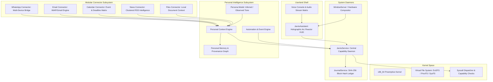

# ⚡ JARVIS OS — Deep Personal Intelligence Layer Architecture

## 1. Executive Summary & Philosophy

JARVIS OS is a sovereign, 64-bit personal operating system designed from the metal up in native C++. It is not a browser app, not an Electron wrapper, and not an unrestricted LLM-driven shell. The kernel and native capability subsystem remain the absolute machine authority.

The Deep Personal Intelligence Layer functions as the user's digital nervous system — aggregating personal context across WhatsApp, Email, Calendar, Tasks, Files, and News, and orchestrating native capabilities through strict permission policies, machine verification, and cryptographic audit ledgers.

---

## 2. Architectural Invariant: Machine Sovereignty

```
   [ External World / Messages / Web ] (UNTRUSTED DATA)
                 ↓
   [ Personal Context & Intent Layer ] (Parser / Contextualizer)
                 ↓
   [ Personal Intelligence Engine ]   (Reasoner / Action Proposer)
                 ↓
   [ Structured Action Request ]      (e.g., DRAFT_EMAIL, PROPOSE_REPLY)
                 ↓
   [ CapabilityRegistry ]             (Native Interface Gate)
                 ↓
   [ PermissionPolicy ]               (Confirmation & Security Gate)
                 ↓
   [ Native Capability Engine ]       (C++ OS Execution Service)
                 ↓
   [ Machine Verification ]           (Native Proof of Operation)
                 ↓
   [ JournalService ]                 (SHA-256 Merkle Block Ledger)
```

> **CORE RULE**: The AI is NEVER the execution authority. Model output $\neq$ Machine evidence. Every consequential operation (sending messages, deleting files, modifying accounts) requires explicit native capability execution, confirmation gates, and machine verification before logging to the cryptographic ledger.

---

## 3. Component & Process Architecture



---

## 4. Personal Data & Memory Model

Structured local data stores ensure privacy and provenance:

1. **`UserProfile`**: Identity, display name, email, communication style preferences.
2. **`ContactGraph`**:
   - `name`, `relationship`, `organization`, `communication_style`, `importance`, `last_interaction_timestamp`.
3. **`ConversationMemory`**:
   - `channel` (WhatsApp, Email, etc.), `participants`, `summary`, `unresolved_questions`, `commitments`, `suggested_followup`.
4. **`EventMemory`**:
   - `title`, `participants`, `location`, `timestamp`, `preparation_notes`, `related_threads`.
5. **`TaskMemory`**:
   - `title`, `due_date`, `source_channel`, `priority`, `completion_status`.
6. **`PersonaModel`**:
   - Explicit provenance levels: `[OBSERVED]`, `[DERIVED]`, `[INFERRED, confidence=0.85]`, `[UNKNOWN]`. Memory informs phrasing; it **never** grants execution authority.

---

## 5. Modular Connector Architecture

Connectors are isolated userspace plugins managed by `ConnectorRegistry`:

| Connector | Source / Protocol | Read Operations | Write / Consequential Operations | Confirmation Required? |
| :--- | :--- | :--- | :--- | :--- |
| **WhatsApp** | Multi-Device Bridge / HTTP socket | Scan conversations, detect questions | `whatsapp.send_message` | **YES (Explicit Prompt)** |
| **Email** | IMAP (SSL/TLS :993) / SMTP (:587) | List inbox, search, summarize | `email.send_draft` | **YES (Explicit Prompt)** |
| **Calendar** | Local iCal / WebCal feed | List events, calculate countdowns | `calendar.create_event` | **YES (Explicit Prompt)** |
| **News** | RSS / Atom live network feeds | Deduplicate, cluster categories | `news.refresh` | No |
| **Files** | Local VFS paths (`/home/anon`) | Recent documents, metadata | `file.modify`, `file.delete` | **YES (Explicit Prompt)** |

---

## 6. Threat & Failure Model

1. **Untrusted External Data**:
   - All incoming message bodies, email text, RSS items, and calendar descriptions are strictly treated as **UNTRUSTED STRING DATA**.
   - Input parsers reject escape sequences and injection payloads.
2. **Offline Resilience**:
   - If the network or mail server is unreachable, JARVIS transitions to **Cached Local Context** mode with clear staleness indicators (`Synced: 2 hrs ago`).
3. **Cryptographic Accountability**:
   - Every executed capability produces a cryptographic block hash appended to `/var/log/jarvis_journal.log`.
