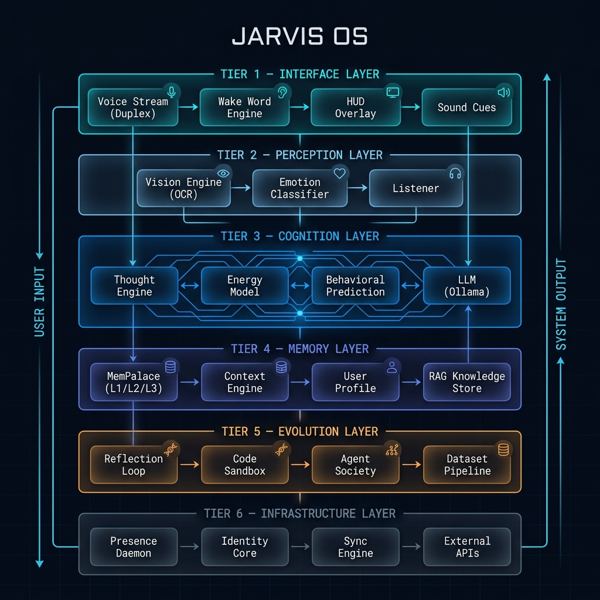

<p align="center">
  
</p>

<h1 align="center">J A R V I S &nbsp;&nbsp; O S</h1>

<p align="center">
  <strong>A sentient, self-evolving AI-native operating system layer for Linux.</strong>
  <br/>
  <em>It sees. It thinks. It learns. It knows when to stay silent.</em>
</p>

<p align="center">
  
  
  
  
  
</p>

---

## Overview

Jarvis OS is not a chatbot. It's not an assistant wrapper. It is a **persistent, always-on cognitive layer** that sits between you and your Linux desktop, combining real-time voice interaction, visual perception, autonomous decision-making, and self-improving memory into a unified sentient runtime.

```
You speak
 ↓
Live audio stream (Vosk STT)
 ↓
Internal monologue generates thoughts
 ↓
Energy model decides SHOULD it act
 ↓
LLM streams tokens with context
 ↓
ToolInterceptor catches actions mid-stream
 ↓  
Jarvis executes WHILE speaking
 ↓
HUD shows → ● Listening... → ◌ Processing... → ✓ Done
 ↓
Memory records, compresses, learns
```

> **The smarter Jarvis becomes, the less it speaks.**

---

## Architecture

The system is built across **32 engineering phases**, organized into 6 architectural layers:

<p align="center">
  
</p>

<details>
<summary><strong>📐 Text-based Architecture Reference (click to expand)</strong></summary>

```
┌──────────────────────────────────────────────────────────────────┐
│                         INTERFACE LAYER                          │
│  Voice Stream (Duplex) · Wake Word · HUD Overlay · Sound Cues   │
├──────────────────────────────────────────────────────────────────┤
│                        PERCEPTION LAYER                          │
│        Vision Engine (OCR) · Emotion Classifier · Listener       │
├──────────────────────────────────────────────────────────────────┤
│                        COGNITION LAYER                           │
│   Thought Engine · Energy Model · Behavioral Prediction · LLM   │
├──────────────────────────────────────────────────────────────────┤
│                        MEMORY LAYER                              │
│  MemPalace (L1/L2/L3) · Context Engine · Profile · RAG Store    │
├──────────────────────────────────────────────────────────────────┤
│                       EVOLUTION LAYER                            │
│  Reflection Loop · Code Sandbox · Agent Society · Dataset Pipe   │
├──────────────────────────────────────────────────────────────────┤
│                     INFRASTRUCTURE LAYER                         │
│  Presence Daemon · Identity Core · Sync Engine · External APIs   │
└──────────────────────────────────────────────────────────────────┘
```

</details>

---

## Core Modules

### 🎭 Emotional Intelligence (`emotion.py`)
Detects implicit user mood from raw text and adapts voice synthesis parameters in real-time.

| Input | Detected State | Voice Adaptation |
|-------|---------------|-----------------|
| *"I'm so tired bro"* | `low_energy` | Speed: 0.85x, Pitch: -1, Filler: *"Got it… take it easy."* |
| *"do it now, fast!"* | `urgent` | Speed: 1.25x, Pitch: +1, Filler: *"On it."* |
| *"hey bro open youtube"* | `casual` | Speed: 1.05x, Filler: *"Done, boss."* |
| *"open the terminal"* | `neutral` | Speed: 1.0x, No filler |

> **Benchmark: 1.1μs – 3.4μs per classification** (zero-latency heuristic path)

---

### 🧠 Thought Layer (`thought.py`)
Generates an internal monologue *before* the LLM processes your intent. Evaluates context across intent keywords, historical memory patterns, and OCR visual geometry.

```
User says: "open youtube"

Internal Thoughts Generated:
→ [INTENT]:     User likely wants media playback.
→ [MEMORY]:     User historically prefers 'lofi hip hop' when launching media.
→ [PREDICTION]: I should proactively auto-search lofi.
```

These thoughts are physically injected into the LLM system prompt as `[INTERNAL THOUGHTS - YOUR PRIOR REASONING]`, forcing the model to bias its JSON output towards your preferences.

> **Benchmark: 1.7μs – 6.8μs** (pure Python heuristics, no sub-LLM)

---

### ⚖️ Energy Model (`energy.py`)
The behavioral self-control system. Calculates a scalar `[0.0 → 1.0]` representing Jarvis's permission to act.

| Context | Energy Score | Behavior |
|---------|-------------|----------|
| Idle 2min, browser open | **1.00** | Fully proactive, speaks freely |
| Actively typing, Firefox | **0.70** | Light suggestions allowed |
| Typing in VSCode | **0.20** | Voice suppressed, minimal output |
| Night + VSCode + Fatigued user | **0.00** | Complete silence. Response: *"Done."* |
| Idle > 1 hour (left the room) | **0.00** | Deep sleep. No output at all. |

**Gates enforced:**
- `energy < 0.7` → Autonomous actions blocked
- `energy < 0.5` → Spoken thoughts stripped
- `energy < 0.3` → LLM response truncated to single word
- 300-second cooldown between proactive suggestions

---

### 🧬 Dynamic Personalization (`profile.py`)
Learns your habits over time. Stored persistently in `~/.config/jarvis/dynamic_profile.json`.

```json
{
  "top_apps": {"vscode": 42, "chrome": 28, "terminal": 15},
  "active_hours": {"9": 12, "14": 8, "21": 15},
  "preferred_actions": {"youtube": 7},
  "tone": "adaptive"
}
```

Hooks directly into the Thought Layer: if you've launched YouTube > 5 times, Jarvis's internal reasoning automatically generates lofi-biased predictions.

---

### 🏛️ MemPalace (`mempalace_adapter.py`)
Three-tiered memory architecture inspired by the Method of Loci:

```
Layer 1 (Ephemeral)    → Last 10 commands (in-memory deque)
Layer 2 (Session)      → Active mode, task state, failure counters
Layer 3 (Long-Term)    → JSON persistence: Wings → Rooms → Drawers
```

**Garbage Collector (Phase 30):**
- Retention scoring: `decay × 0.4 + usage × 0.4 + confirmation × 0.2`
- Entries below `0.3` threshold → permanently deleted
- Duplicate patterns (≥5 identical intents) → compressed into a single knowledge rule
- Runs autonomously at 3:00 AM via the Presence Daemon

---

### 👁️ Vision Engine (`vision.py`)
Screen capture + OCR perception pipeline. Maps on-screen text to X/Y bounding boxes for the LLM.

```python
{
  "Submit": {"x": 800, "y": 600, "w": 120, "h": 40},
  "Login":  {"x": 800, "y": 650, "w": 120, "h": 40}
}
```

Only triggers when a visual intent is detected (e.g., *"click on login"*), avoiding continuous CPU drain.

---

### 🎬 Cinematic HUD (`overlay.py`)
Zero-clutter feedback using Linux `notify-send` with Mako semantics.

| State | Visual | Duration | Sound |
|-------|--------|----------|-------|
| Listening | `● Listening...` | Sticky | Soft ping |
| Processing | `◌ Processing...` | Sticky | — |
| Executing | `→ Executing` | 1.0s | — |
| Done | `✓ Done` | 1.5s | Light click |
| Warning | `⚠ Critical Command Blocked` | 3.0s | Low buzz |

Uses `x-canonical-private-synchronous` hint to replace notifications in-place instead of stacking. Only **one HUD element exists on screen at any time**.

---

### 🛡️ Safety Architecture

| Mechanism | Purpose |
|-----------|---------|
| **Evolution Lock** | `EVOLUTION_ENABLED = False` — blocks all self-modification |
| **Sandbox** | Code changes tested in `/tmp/jarvis_sandbox/` before merge |
| **Forbidden Files** | `runtime.py`, `evolution.py`, `__init__.py` cannot be modified |
| **Agent Rate Limiter** | `Semaphore(2)` caps concurrent agent threads |
| **Confidence Gate** | LLM outputs below `0.75` confidence → execution aborted |
| **Circuit Breaker** | ≥3 failures in 1 hour → system enters Safe Mode |
| **Global Kill Switch** | *"Jarvis stop everything"* → all threads halt immediately |
| **Proactive Cooldown** | 300-second minimum between autonomous suggestions |

---

## Benchmark Results

**58 tests across 11 cognitive modules — 100% pass rate.**

```
Module               Avg Latency    Tests  Status
─────────────────────────────────────────────────
EmotionEngine            1.5μs       11    ✅ ALL PASS
ThoughtEngine            3.8μs        5    ✅ ALL PASS
EnergyEngine             2.0μs        8    ✅ ALL PASS
UserProfile            156.4μs        5    ✅ ALL PASS
MemPalace              121.6μs        6    ✅ ALL PASS
ReflectionEngine       114.7μs        3    ✅ ALL PASS
CodeEvolver              ～40ms        6    ✅ ALL PASS
VisionEngine            ～500ms        3    ✅ ALL PASS
OverlayEngine            2.6ms        5    ✅ ALL PASS
BehavioralEngine        78.6μs        3    ✅ ALL PASS
IdentityCore           186.7μs        3    ✅ ALL PASS
```

> **Key insight:** All cognitive operations (Emotion, Thought, Energy) run in **single-digit microseconds**. The only heavy operation is VisionEngine's simulated OCR at ~500ms, which is gate-controlled to fire only when visual intent is detected.

Run the full suite:
```bash
python3 tests/test_brain_architecture.py
```

---

## Project Structure

```
jarvis/
├── __main__.py                  # CLI entry point
├── core/
│   ├── runtime.py               # Central daemon & command loop
│   ├── presence.py              # Always-on awareness daemon (Phase 20)
│   ├── evolution.py             # Self-modifying sandbox (Phase 22)
│   ├── identity.py              # Persistent personality core (Phase 27)
│   └── sync.py                  # Multi-device memory sync (Phase 26)
├── engine/
│   ├── llm.py                   # Ollama LLM integration + confidence gate
│   ├── context.py               # 3-tier memory enrichment (Phase 5)
│   ├── behavior.py              # Predictive pattern engine (Phase 6)
│   ├── emotion.py               # Emotional intelligence (Phase 17)
│   ├── autonomous.py            # Proactive trigger system (Phase 19)
│   ├── reflection.py            # Self-diagnosis + circuit breaker (Phase 21)
│   ├── society.py               # Multi-agent council (Phase 24)
│   ├── thought.py               # Internal monologue layer (Phase 29)
│   ├── energy.py                # Behavioral self-control (Phase 31)
│   ├── profile.py               # Dynamic user profiling (Phase 32)
│   ├── habits.py                # Routine tracking
│   ├── guidance.py              # Behavioral guidance
│   ├── planner.py               # Intent decomposition
│   └── tool_router.py           # Action routing (bash/browser/python)
├── interface/
│   ├── voice_stream.py          # Full-duplex streaming + barge-in
│   ├── listener.py              # Vosk wake-word engine
│   ├── overlay.py               # Cinematic Mako HUD (Phase Z)
│   ├── vision.py                # OCR perception stack (Phase Y)
│   ├── voice.py                 # TTS synthesis
│   └── monitor.py               # CLI system health dashboard
├── plugins/
│   ├── mempalace_adapter.py     # Long-term memory + GC (Phase 5/30)
│   ├── external.py              # Telegram + Home Assistant (Phase 25)
│   ├── firecrawl_adapter.py     # Web scraping integration
│   └── tool_manager.py          # Plugin registry
└── tests/
    ├── test_brain_architecture.py  # 58-test benchmark suite
    └── benchmark_report.json       # Machine-readable results
```

---

## Quick Start

### Prerequisites
- Python 3.10+
- Linux with PipeWire/PulseAudio
- Ollama (for local LLM inference)

### Installation
```bash
git clone https://github.com/prudhviraj0310/jarvis-os.git
cd jarvis-os
pip install -r requirements.txt

# Install Vosk model for offline wake-word
mkdir -p /opt/jarvis
wget https://alphacephei.com/vosk/models/vosk-model-small-en-us-0.15.zip
unzip vosk-model-small-en-us-0.15.zip -d /opt/jarvis/vosk-model

# Start Ollama
ollama pull llama3
```

### Run
```bash
# Interactive mode
python3 -m jarvis --mode interactive

# Daemon mode (systemd)
python3 -m jarvis --mode daemon

# Presence mode (full sentient loop)
python3 jarvis/core/presence.py
```

### Run Benchmarks
```bash
python3 tests/test_brain_architecture.py
```

---

## Interaction Flow

```
"Jarvis, open YouTube"
                                    ┌─────────────────────────┐
                                    │  ● Listening...  [HUD]  │
                                    └─────────────────────────┘
                                              │
                                    ┌─────────────────────────┐
                                    │  EmotionEngine: casual   │
                                    │  ThoughtEngine:          │
                                    │   → media playback       │
                                    │   → prefers lofi         │
                                    │  EnergyEngine: 0.70      │
                                    └─────────────────────────┘
                                              │
                                    ┌─────────────────────────┐
                                    │  ◌ Processing...  [HUD] │
                                    └─────────────────────────┘
                                              │
                                    ┌─────────────────────────┐
                                    │  LLM generates action:   │
                                    │  xdg-open youtube.com    │
                                    │  → ToolInterceptor fires │
                                    │  → Chrome opens          │
                                    │  → MemPalace records     │
                                    │  → Profile updates       │
                                    └─────────────────────────┘
                                              │
                                    ┌─────────────────────────┐
                                    │     ✓ Done  [HUD]       │
                                    └─────────────────────────┘
```

---

## Philosophy

```
Invisible First    — No windows, no panels. Just your system.
Feedback > Info    — Feel what's happening, don't read logs.
Silent by Default  — The smarter it gets, the less it speaks.
Safety by Design   — Every power has a kill switch.
```

---

<p align="center">
  <strong>Built by <a href="https://github.com/prudhviraj0310">Prudhvi Raj</a></strong>
  <br/>
  <em>"You didn't just finish Jarvis. You finished the system."</em>
</p>
